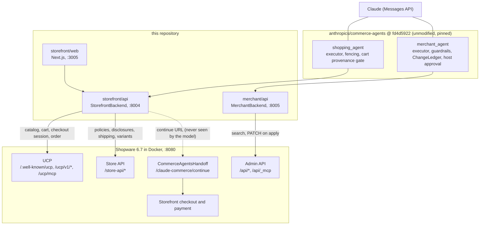

# Shopware × Claude Commerce Agents

Anthropic's [Commerce Agents blueprint](https://github.com/anthropics/commerce-agents) running unmodified against a real Shopware 6.7 shop: shopping over UCP, merchant operations over the Admin API, checkout and payment left to Shopware.

[](LICENSE)
[](docs/version-matrix.md)
[](requirements.txt)
[](package.json)
[](https://github.com/anthropics/commerce-agents/tree/fd4d59224ab96b43c6dc6888207c67b3bd5a24cf)
[](https://ucp.dev)

## Why this exists

Anthropic published a blueprint for commerce agents: two backend contracts (`StorefrontBackend`, `MerchantBackend`), a harness that enforces safety in the tool executor rather than in the prompt, skills for the long-tail flows, and reference runtimes. Shopify showed how a platform adopts it: implement the two contracts, leave the blueprint packages untouched. This repository does the same for Shopware, so that Shopware is the commerce execution layer the blueprint runs against.

Three properties of Shopware make this a natural fit rather than a port:

1. **Shopware speaks UCP natively.** The `SwagAgenticCommerce` plugin (on top of `ucp-php-sdk`) exposes discovery, REST, MCP, embedded checkout, and OAuth Identity Linking per sales channel. The shopping backend is a UCP client, the same shape Shopify uses.
2. **Shopware's Admin MCP server defaults every write tool to `dryRun=true`.** That is the "stage, preview, approve, apply" loop the merchant agent requires, available from the core instead of hand-written diffs. This repository wires it in as an optional transport (see [Status](#status-and-roadmap)).
3. **Commerce semantics live in the core.** Variants, delivery times, unit prices (German PAngV base price), promotions, customer groups. The blueprint asks for exactly these as `ProductDetails.variants`, `FulfillmentOption`, `Disclosure`, and `PricingContext`.

## What you get

| Component | What it does | Where |
|---|---|---|
| Shopping agent host | FastAPI host implementing `StorefrontBackend`: catalog and cart over UCP (REST first, MCP fallback), policies, disclosures, fulfillment and variant enrichment over the Store API, checkout as a handoff into Shopware | `storefront/api/` |
| Shopping web UI | Next.js storefront from the blueprint's `web-shared`: product grid, cart drawer, assistant rail, "Check out on Shopware" button, branding read from the shop | `storefront/web/` |
| Merchant agent host | FastAPI host implementing `MerchantBackend` over Admin REST: catalog cache, business snapshot, low-stock alerts, pricing context, staged listing / price / inventory changes with an approval route | `merchant/api/` |
| Local Shopware | `dockware/shopware:6.7.13.0` plus a bootstrap that installs `SwagAgenticCommerce`, `SwagMcpMerchantTools`, and the tiny `CommerceAgentsHandoff` plugin, enables UCP, generates signing keys, seeds variants and a base-price product | `docker/` |
| Blueprint, unmodified | `commerce-common`, `shopping-agent-*`, `merchant-agent-*` installed from Anthropic's repo at a pinned commit; `demo_common`, `web-shared`, and skills vendored verbatim | `requirements.txt`, `vendor/` |
| Mapping notes | Live UCP tool names, REST paths, cart-id semantics, handoff mechanics, Store API gaps | `docs/shopware-mapping.md` |

## Demo video

[](docs/media/explainer.mp4)

The full-resolution file is [`docs/media/explainer.mp4`](docs/media/explainer.mp4) (1080p, 2 min), the poster is [`docs/media/explainer-poster.png`](docs/media/explainer-poster.png), and the script and re-render instructions are in [`docs/media/README.md`](docs/media/README.md).

## Architecture



Identity, tokens, and the checkout URL stay inside the hosts. The model only ever sees fenced tool results.

## Quick start

Prerequisites: Docker, Python 3.11+, `git` (the blueprint packages install from GitHub), `curl`. Node 22 only for the optional web UI. Everything runs from the repo root.

```bash
docker compose -f docker/compose.yaml up -d
./docker/bootstrap.sh
python3 -m venv .venv && source .venv/bin/activate && pip install -r requirements-dev.txt
cp .env.example .env && cat docker/.generated.env >> .env
uvicorn storefront.api.main:app --port 8004
```

Optional web UI (Node 22):

```bash
npm install && npm run dev:storefront
```

Merchant host, in a second terminal with the same venv:

```bash
uvicorn merchant.api.main:app --port 8005
```

Chat turns need `ANTHROPIC_API_KEY` in `.env`. Search, product details, cart, checkout handoff, and the merchant reads work without it.

`bootstrap.sh` is idempotent. Re-run it after `docker compose ... down` and `up`, because a recreated container drops the plugin files (MySQL data survives in the `shopware-mysql` volume). Details in [`docker/README.md`](docker/README.md).

## URLs

| What | URL | Notes |
|---|---|---|
| Shopware storefront | http://localhost:8080 | dockware demo catalog plus seeded rows |
| Shopware admin | http://localhost:8080/admin | `admin` / `shopware` |
| UCP discovery | http://localhost:8080/.well-known/ucp | protocol `2026-04-08` |
| Shopping agent API | http://localhost:8004 | `GET /api/health`, `POST /api/session`, `POST /api/chat` (SSE) |
| Shopping web UI | http://localhost:3005 | `npm run dev:storefront` |
| Merchant agent API | http://localhost:8005 | `GET /api/merchant/health`, `POST /api/merchant/session`, `POST /api/merchant/chat`, `POST /api/merchant/changes/{id}/apply` |
| MySQL | `localhost:3306` | `root` / `root`, database `shopware` |

## Try it

The seeded shop is German (`DE`, `EUR`). Prompts work in English or German.

**Shopping agent** (web UI at :3005, or `POST /api/chat`):

- "I'm looking for a gift under 50 euros."
- "Add the first one in size M to my cart."
- "What is the withdrawal period?" (answered from the shop's CMS footer pages, `/agents.md`, or the fallback copy)
- "Show me the base price of the olive oil." (server-authored PAngV disclosure rows)
- "How long does shipping take?" (shipping methods and `deliveryTime` from the Store API)
- Click "Check out on Shopware": the cart lands in Shopware's `/checkout/confirm` with the same items.

**Merchant agent** (`POST /api/merchant/chat`):

- "What needs my attention today?"
- "Which products are low on stock?"
- "Raise the price of the T-shirt by 10 percent and show me the change first."
- "Restock the T-shirt in size L by 20." Then approve with `POST /api/merchant/changes/{id}/apply` (nothing is written until then).

## How it maps

Full tables, live tool names, and the spike notes are in [`docs/shopware-mapping.md`](docs/shopware-mapping.md).

| Blueprint contract | Method group | Shopware surface |
|---|---|---|
| `StorefrontBackend` | Catalog (`search_products`, `get_product_details`) | UCP `catalog.search` / `catalog.lookup`; variants filled from Store API `POST /store-api/product` by `parentId` |
| `StorefrontBackend` | Cart (`get_cart`, `add_to_cart`, `update_cart_item`, `remove_from_cart`) | UCP carts (`/ucp/v1/carts`); the UCP cart id is the Store API `sw-context-token` |
| `StorefrontBackend` | Checkout (`checkout_handoff`) | UCP checkout session is staged; the browser opens `/claude-commerce/continue?token={cartId}` which adopts the cart into the storefront session and redirects to `/checkout/confirm` |
| `StorefrontBackend` | Orders (`get_orders`, `get_order`) | Session ledger `checkout_id → order.id` via UCP `get_checkout`, details via UCP `get_order` (agent-placed orders only) |
| `StorefrontBackend` | Policies (`search_policies`) | Store API footer / service navigation → CMS pages, plus `/agents.md`, `/llms.txt`; German fallback copy when the shop has none |
| `StorefrontBackend` | Disclosures (`get_disclosure`) | Store API `calculatedPrice.referencePrice`, `deliveryTime`, stock; fixed copy from `storefront/data/disclosure_copy.de.json` |
| `StorefrontBackend` | Fulfillment (`get_fulfillment_options`) | Store API shipping methods plus product `deliveryTime` |
| `StorefrontBackend` | Preferences (`get_preferences`) | Static guest profile (`DE`, `de`, `EUR`); Identity Linking not wired yet |
| `MerchantBackend` | Performance (`get_business_snapshot`, `query_metrics`) | Admin `POST /api/search/order` (last 50 orders); `sales` and `orders` series; traffic reported as unavailable |
| `MerchantBackend` | Catalog (`search_listings`, `get_listing`) | Admin `POST /api/search/product` into a local catalog cache |
| `MerchantBackend` | Health (`get_inventory_alerts`, `get_order_issues`) | Low stock from the cache against `low_stock_default`; order issues return an empty list |
| `MerchantBackend` | Pricing (`get_pricing_context`) | `product.price` per family and variant; guardrail caps mirrored from config |
| `MerchantBackend` | Staged writes (`stage_listing_update`, `stage_price_update`, `stage_inventory_action`, `stage_promotion`) | Ledger only. Listing fields are whitelisted at stage time (`title`, `description`, `seo_title`, `seo_description`) |
| `MerchantBackend` | `apply_change` | Guardrails re-run, then Admin `PATCH /api/product/{id}` (name, description, meta, price, stock, active). Promotions and campaigns are recorded, not written |
| `MerchantBackend` | `stage_campaign`, `get_campaign_performance` | `ChangeNotApplicable`; surfaced in `get_merchant_context().limitations` |

## Safety model

The blueprint enforces its rules in the tool executor; this repository adds nothing to the model's prompt to get them. What each layer holds:

| Rule | Enforced by the blueprint harness | Enforced by Shopware or this host |
|---|---|---|
| Untrusted content | Every backend result is sanitized and fenced (product descriptions, CMS text, customer comments) | HTML is stripped from product and CMS text before it enters the fence |
| Cart provenance | Cart writes only accept product ids returned by a tool in this session (grid warm-up products are registered as seen) | Availability is checked before the write; an out-of-stock variant raises `Unavailable` listing in-stock siblings |
| No payment in the agent | No `place_order` / `charge` method exists | `complete_checkout` is never called (opt-in flag `SHOPWARE_AGENT_COMPLETE_CHECKOUT`, default `0`); payment happens in Shopware's checkout |
| Handoff URL | `checkout_handoff` results never reach the model | The URL is served to the browser via `GET /api/cart` only |
| Merchant staging | `stage_*` writes the ledger; `apply_change` requires a host-approved id (`MERCHANT_REQUIRE_HOST_APPROVAL=1`) | `apply` is the only code path that issues Admin `PATCH` (proven in `merchant/api/tests/test_staging.py`); a failed write leaves the change staged |
| Guardrails | Price delta, discount depth, restock size, protected fields, items per change, checked at stage and again at apply | Field whitelist for listing updates rejected at stage time |
| Identity | No tool argument carries a user or merchant id | Admin token, Store API access key, and optional OAuth tokens live in the host only and are never logged |
| Request authenticity | — | `UCP-Agent` profile header on every call, `Idempotency-Key` on writes; local policy is `signature-policy=log`, production must use `strict` (see [Status](#status-and-roadmap)) |

Deployment notes that are yours to own (auth on the host routes, rate limits, memory retention, log hygiene): [`docs/security.md`](docs/security.md).

## Repository layout

```text
.
├── agent-profile.json        UCP agent profile (served to the shop from inside the container)
├── requirements.txt          blueprint packages pinned to fd4d5922 + runtime deps
├── requirements-dev.txt      + pytest
├── package.json              npm workspaces: vendor/web-shared, storefront/web
├── docker/
│   ├── compose.yaml          dockware/shopware:6.7.13.0, ports 8080 and 3306
│   ├── bootstrap.sh          plugins, UCP exposure, signing keys, seed, .generated.env
│   ├── enable_ucp.py         sales-channel UCP configuration
│   ├── seed_catalog.py       CA-TSHIRT (S/M/L, L out of stock), CA-OIL (base price)
│   ├── write_credentials.py  emits docker/.generated.env
│   └── plugins/CommerceAgentsHandoff/   adopts the UCP cart token into the storefront session
├── storefront/
│   ├── api/                  FastAPI host, UcpClient, StorefrontBackend, Store API client,
│   │                         policies, disclosures, identity (stub), tests
│   ├── web/                  Next.js UI on :3005
│   ├── data/                 recorded UCP responses, discovery fixture, disclosure copy
│   └── scripts/smoke.py      live guest flow without an Anthropic key
├── merchant/
│   ├── api/                  FastAPI host, AdminClient, MerchantBackend, catalog cache,
│   │                         staging writer, FakeAdmin, tests
│   ├── data/                 seed.json (SHOPWARE_LOCAL_STORE=1), thresholds.json
│   └── scripts/smoke_live.py read-only Admin API check
├── vendor/                   unmodified demo_common, web-shared, skills (see NOTICE)
├── docs/                     shopware-mapping.md, security.md, version-matrix.md
└── progress.md               phase checklist
```

## Testing and verification

Offline (recorded fixtures via `httpx.MockTransport`, no Docker, no Anthropic key):

```bash
pytest
```

Against the running Docker shop:

```bash
curl -sS http://localhost:8080/.well-known/ucp | head
python storefront/scripts/smoke.py
python merchant/scripts/smoke_live.py --read-only
```

`smoke.py` runs discovery, search, product details with variants, add / update / remove on a real UCP cart, checkout handoff URL, and a policy search. `smoke_live.py` reads the catalog, business snapshot, and inventory alerts and performs no writes.

Merchant host without a live shop:

```bash
SHOPWARE_LOCAL_STORE=1 uvicorn merchant.api.main:app --port 8005
```

Web build:

```bash
npm run build
```

## Configuration

`.env.example` documents every variable. The ones you will touch:

| Variable | Default | Purpose |
|---|---|---|
| `ANTHROPIC_API_KEY` | empty | Required for chat turns only |
| `ANTHROPIC_WORKSPACE_ID` | empty | Only for identity-linked keys (API answers 400 `anthropic-workspace-id is required` without it); Console → Settings → Workspaces, `wrkspc_…` |
| `SHOPWARE_URL`, `SHOPWARE_ADMIN_URL` | `http://localhost:8080` | Sales-channel domain serving `/.well-known/ucp`; Admin API base |
| `SHOPWARE_SALES_CHANNEL_ACCESS_KEY` | from `docker/.generated.env` | Store API `sw-access-key` |
| `UCP_TRANSPORT` | `rest` | `rest` or `mcp` for the shopping backend |
| `UCP_AGENT_PROFILE_URL` | `http://localhost/agent-profile.json` | Fetched by Shopware from inside the container |
| `SHOPWARE_ADMIN_USERNAME` / `PASSWORD` or `SHOPWARE_INTEGRATION_ACCESS_KEY` / `SECRET_KEY` | `admin` / `shopware` | Merchant Admin API auth (password grant or integration client credentials) |
| `SHOPWARE_ADMIN_TRANSPORT` | `rest` | `mcp` routes previews through Admin MCP `shopware-entity-upsert` with `dryRun=true` |
| `MERCHANT_REQUIRE_HOST_APPROVAL` | `1` | Keep on; chat cannot apply changes on its own |
| `SHOPWARE_AGENT_COMPLETE_CHECKOUT` | `0` | Keep off; the agent never completes a checkout |
| `SHOPWARE_LOCAL_STORE` | unset | `1` runs the merchant host on `merchant/data/seed.json` with no live shop |

## Status and roadmap

This is the first working version (blueprint phases 0 to 2 of the internal masterplan; checklist in [`progress.md`](progress.md)).

Working end to end against the Docker shop:

- Guest shopping: search, details with variants, real UCP cart, checkout handoff into Shopware's confirm page with the same cart, policy search, PAngV disclosures, shipping options.
- Merchant: catalog reads, business snapshot, low-stock alerts, pricing context, staged listing / price / inventory changes, approval route that writes via Admin `PATCH`.
- Offline test suite with recorded fixtures; live smoke scripts for both hosts.

Not yet implemented (honest list):

| Item | Current behaviour |
|---|---|
| Identity Linking (UCP OAuth) | `GET /api/auth/shopware/start` answers 503; every session is a guest with a static profile |
| RFC 9421 request signing | Not implemented. Local shop runs `signature-policy=log` (unsigned accepted). `UCP_AGENT_SIGNING_KEY_PEM_FILE` is reserved |
| Server-side dry-run previews | Stage previews (`before` / `after`) are computed in the host from the catalog cache. Admin MCP `dryRun=true` is wired behind `SHOPWARE_ADMIN_TRANSPORT=mcp` and is not the default path |
| Merchant promotions | Staged as price deltas; `apply_change` records them in the ledger only, no Shopware promotion entity is created |
| Merchant campaigns | `stage_campaign` and `get_campaign_performance` raise `ChangeNotApplicable` |
| Order issues, slow movers, traffic, conversion | `get_order_issues` returns an empty list; snapshot covers the last 50 orders; traffic and conversion are reported as unavailable |
| Metrics aggregation | Daily `sales` / `orders` for the last 7 days from the order list, no Admin API aggregations yet |
| Merchant web portal | Routes only (`/api/merchant/*`); no operator UI in this repository |
| `complete_checkout` | Never called; opt-in flag exists, default off |
| Claude Code plugin, evals, Managed Agents manifests | Masterplan phase 3, not started |
| CI | No GitHub Actions workflow yet |

Later phases (Shopware plugin with staged-change entity and admin approval module, Store API MCP tools for policies and disclosures, SDK) are described in the internal masterplan (§5).

## Versions

| Piece | Pin |
|---|---|
| Shopware | `dockware/shopware:6.7.13.0`, PHP 8.4 |
| Anthropic blueprint | `fd4d59224ab96b43c6dc6888207c67b3bd5a24cf` |
| UCP protocol | `2026-04-08` |
| `SwagAgenticCommerce` | git `main` at bootstrap time (v1.3.0 observed) |
| `ucp-php-sdk/symfony-bundle` | `>=0.0.5 <0.1.0` |
| Python / Node | 3.11+ / 22 |

See [`docs/version-matrix.md`](docs/version-matrix.md).

## Contributing

- Do not edit anything under `vendor/` or the blueprint packages; Shopware-specific code lives in `storefront/` and `merchant/`.
- Run `pytest` before opening a pull request; add recorded fixtures for new UCP or Admin calls so the suite stays offline.
- Keep every method of the two contracts honest: return `None` plus a `note` rather than fabricated numbers when Shopware has no source.

## License

This repository's own code is MIT-licensed, see [`LICENSE`](LICENSE). The vendored Anthropic blueprint code under `vendor/` and the files carrying Anthropic or Shopify copyright headers remain Apache-2.0 with their original notices (full text in [`vendor/LICENSE-APACHE-2.0`](vendor/LICENSE-APACHE-2.0), attribution in [`NOTICE`](NOTICE)).
