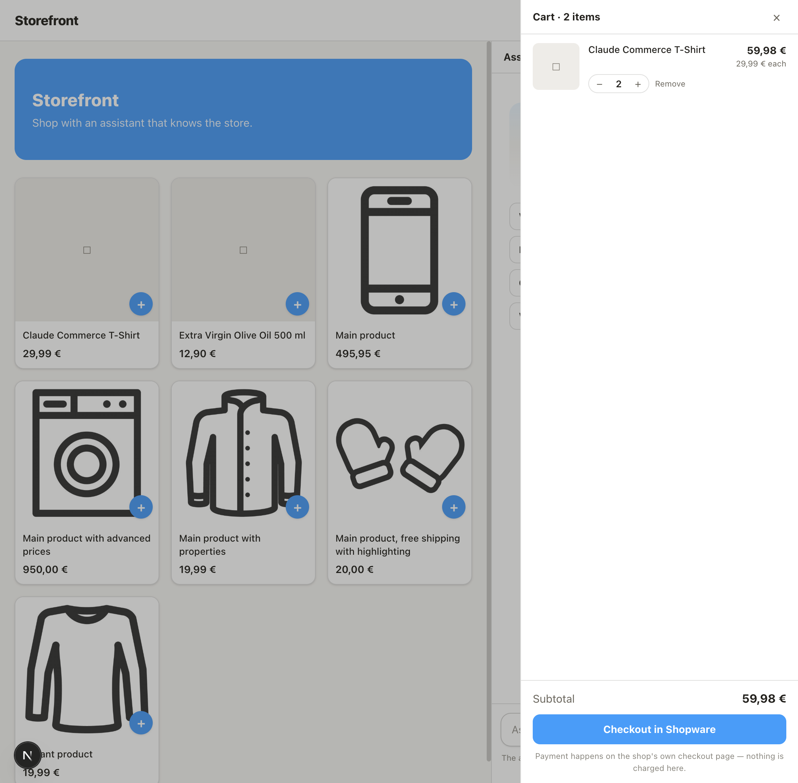
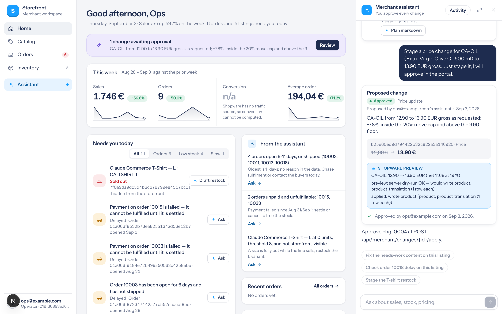
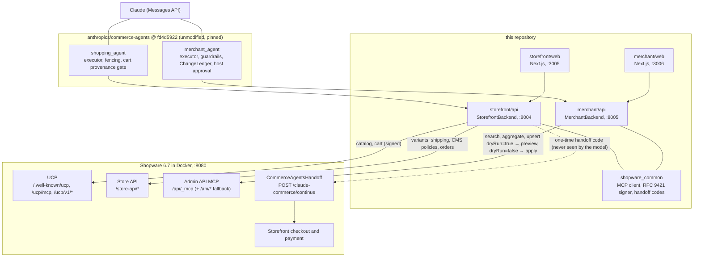

# Shopware × Claude Commerce Agents

Anthropic's [Commerce Agents blueprint](https://github.com/anthropics/commerce-agents) running unmodified against a real Shopware 6.7 shop: shopping over UCP (MCP first), merchant operations over the Admin API MCP with server-side dry-run previews, checkout and payment left to Shopware.

[](LICENSE)
[](docs/version-matrix.md)
[](requirements.txt)
[](package.json)
[](https://github.com/anthropics/commerce-agents/tree/fd4d59224ab96b43c6dc6888207c67b3bd5a24cf)
[](https://ucp.dev)
[](https://github.com/sthamann/shopware_claude_commerce/actions/workflows/ci.yml)
[](https://github.com/sthamann/shopware_claude_commerce/actions/workflows/integration.yml)

## Why this exists

Anthropic published a blueprint for commerce agents: two backend contracts (`StorefrontBackend`, `MerchantBackend`), a harness that enforces safety in the tool executor rather than in the prompt, skills for the long-tail flows, and reference runtimes. Shopify showed how a platform adopts it: implement the two contracts, leave the blueprint packages untouched. This repository does the same for Shopware, so that Shopware is the commerce execution layer the blueprint runs against.

Three properties of Shopware make this a natural fit rather than a port:

1. **Shopware speaks UCP natively.** The `SwagAgenticCommerce` plugin (on top of `ucp-php-sdk`) exposes discovery, REST, MCP, embedded checkout, and OAuth Identity Linking per sales channel. The shopping backend is a UCP client over MCP, with REST as the fallback transport.
2. **Shopware's Admin MCP server defaults every write tool to `dryRun=true`.** That is the "stage, preview, approve, apply" loop the merchant agent requires: `stage_*` runs the write as a dry run and turns the server's answer into the `before → after` preview, `apply_change` replays the same payload with `dryRun=false`.
3. **Commerce semantics live in the core.** Variants, delivery times, unit prices (German PAngV base price), promotions, customer groups. The blueprint asks for exactly these as `ProductDetails.variants`, `FulfillmentOption`, `Disclosure`, and `PricingContext`.

## What you get

| Component | What it does | Where |
|---|---|---|
| Shopping agent host | FastAPI host implementing `StorefrontBackend`: catalog and cart over UCP (MCP primary, REST fallback, RFC 9421 signed), variants / delivery time / base price / shipping / CMS policies / orders over the Store API, checkout as a one-time-code handoff into Shopware, UCP Identity Linking (OAuth + PKCE) | `storefront/api/` |
| Shopping web UI | Next.js storefront on the blueprint's `web-shared`: product grid, cart drawer, assistant rail, "Checkout in Shopware", branding read from the shop | `storefront/web/` |
| Merchant agent host | FastAPI host implementing `MerchantBackend` over Admin MCP as a least-privilege integration: snapshot and metrics from aggregations, inventory alerts, order issues, pricing context, staged listing / price / inventory / promotion changes with server dry-run previews, SQLite ledger, approval routes, portal routes | `merchant/api/` |
| Merchant portal | Next.js portal mirroring Anthropic's reference merchant portal: KPI row, "Needs you today", assistant rail with staged-change cards (diff, Shopware preview notes, Approve / Discard) | `merchant/web/` |
| Local Shopware | `dockware/shopware:6.7.13.0` plus an idempotent bootstrap: pinned `SwagAgenticCommerce` and `SwagMcpMerchantTools`, the `CommerceAgentsHandoff` plugin, UCP with `signature-policy=strict`, agent signing key, merchant integration + ACL role + MCP allowlist, seeded variants, base-price product, delivery times, shipping prices, CMS policy pages, order history | `docker/` |
| Shared client code | Streamable-HTTP MCP client, RFC 9421 + 9530 request signer, handoff code issuer / verifier, Anthropic client factory | `shopware_common/` |
| Blueprint, unmodified | `commerce-common`, `shopping-agent-*`, `merchant-agent-*` installed from Anthropic's repo at a pinned commit; `demo_common`, `web-shared`, and skills vendored verbatim | `requirements.txt`, `vendor/` |
| Mapping notes | Live UCP and Admin MCP tool names and schemas, REST paths, cart-id semantics, handoff mechanics, Store API surfaces, write payloads | `docs/shopware-mapping.md` |
| Claude Code plugin | `shopware-commerce-builder`: five commands (scaffold, add flow, author evals, review, UCP doctor) and six skills that state what Shopware adds to Anthropic's `commerce-builder` plugin; marketplace manifest at the repo root | `plugins/shopware-commerce-builder/`, `.claude-plugin/` |
| Eval suite | 107 YAML cases (64 shopping, 43 merchant), deterministic scorers plus one pinned LLM judge, replay and live backends, CI-set selection and gate (`evals/gates.yaml`) | `evals/` |
| CI workflows | `ci.yml` (ruff, pytest on 3.11/3.12, Next.js builds, handoff plugin PHPUnit; netless) and `integration.yml` (nightly Docker Shopware bootstrap + smoke, optional eval CI set) | `.github/workflows/` |
| Shopware plugin (Phase 4, first increment) | `SwagCommerceAgentTools`: nine MCP tools in Shopware itself. Store API: `shopping-policy-search`, `shopping-disclosure`, `shopping-fulfillment-options`. Admin API: `agent-change-stage`, `-list`, `-apply`, `-discard`, `agent-business-snapshot`, `agent-metrics-series`. Staged-change entity, Flow Builder triggers, ACL role templates | `shopware-plugins/SwagCommerceAgentTools/` |
| Browser demo (in progress) | Zero-install demo of the same stack on Shopware in PHP WASM; feasibility measured, build not started in this tree | `docs/browser-demo-feasibility.md` |

## Demo video

https://github.com/user-attachments/assets/60dd0425-91ba-43fc-bd2c-f5c750158e7c

The full-resolution file is published as a release asset: [`explainer.mp4`](https://github.com/sthamann/shopware_claude_commerce/releases/download/v0.1.0-preview/explainer.mp4) (1080p, 2:29, 27 MB, from the [v0.1.0-preview](https://github.com/sthamann/shopware_claude_commerce/releases/tag/v0.1.0-preview) pre-release); the web variant is [`docs/media/explainer-web.mp4`](docs/media/explainer-web.mp4) (720p), the poster is [`docs/media/explainer-poster.png`](docs/media/explainer-poster.png), and the script and re-render instructions are in [`docs/media/README.md`](docs/media/README.md).

## Screenshots

| Storefront (`:3005`) | Merchant portal (`:3006`) |
|---|---|
|  |  |

## Architecture



Identity, tokens, and the checkout URL stay inside the hosts. The model only ever sees fenced tool results.

## Quick start

Prerequisites: Docker, Python 3.11+, `git` (the blueprint packages install from GitHub), `curl`, `openssl`. Node 22 only for the web UIs. Everything runs from the repo root.

```bash
docker compose -f docker/compose.yaml up -d
./docker/bootstrap.sh                      # idempotent; run it again after every `compose down/up`
python3 -m venv .venv && source .venv/bin/activate && pip install -r requirements-dev.txt
cp .env.example .env                       # add ANTHROPIC_API_KEY (+ ANTHROPIC_WORKSPACE_ID for identity-linked keys)
uvicorn storefront.api.main:app --port 8004
```

Both hosts read `docker/.generated.env` (shop credentials, signing key path, handoff secret, integration keys) for every variable your `.env` leaves empty, so you do not have to copy values around.

Merchant host, in a second terminal with the same venv:

```bash
uvicorn merchant.api.main:app --port 8005
```

Web UIs (Node 22):

```bash
npm install
npm run dev:storefront     # http://localhost:3005
npm run dev:merchant       # http://localhost:3006
```

Chat turns need `ANTHROPIC_API_KEY` in `.env`. Search, product details, cart, checkout handoff, the merchant reads, and the portal dashboard work without it.

`bootstrap.sh` is idempotent: re-running it produces the same state (one shop signing key, one agent signing key, one integration, one ACL role, no duplicate seed rows). Re-run it after `docker compose ... down` and `up`, because a recreated container drops the plugin files (MySQL data survives in the `shopware-mysql` volume). `docker/verify.sh` checks the result. Details in [`docker/README.md`](docker/README.md).

## URLs

| What | URL | Notes |
|---|---|---|
| Shopware storefront | http://localhost:8080 | dockware demo catalog plus seeded rows and orders |
| Shopware admin | http://localhost:8080/admin | `admin` / `shopware` (bootstrap only; the hosts never use it) |
| UCP discovery | http://localhost:8080/.well-known/ucp | protocol `2026-04-08`, one active shop signing key |
| Shopping agent API | http://localhost:8004 | `GET /api/health`, `POST /api/session`, `POST /api/chat` (SSE), `GET /api/cart`, `POST /api/cart/add`, `GET /api/checkout/handoff/{ticket}`, `GET /api/auth/status` |
| Shopping web UI | http://localhost:3005 | `npm run dev:storefront` |
| Merchant agent API | http://localhost:8005 | `GET /api/merchant/health`, `POST /api/merchant/session`, `POST /api/merchant/chat`, `GET /api/merchant/dashboard`, `GET /api/merchant/orders`, `GET /api/merchant/changes`, `POST /api/merchant/changes/{id}/apply`, `POST /api/merchant/changes/{id}/discard` |
| Merchant portal | http://localhost:3006 | `npm run dev:merchant` |
| MySQL | `localhost:3306` | `root` / `root`, database `shopware` |

## Try it

The seeded shop is German (`DE`, `EUR`). Prompts work in English or German.

**Shopping agent** (web UI at :3005, or `POST /api/chat`):

- "I'm looking for a gift under 50 euros."
- "Add the first one in size M to my cart."
- "What is the withdrawal period?" (answered from the shop's CMS footer pages, `/agents.md`, or the fallback copy)
- "Show me the base price of the olive oil." (server-authored PAngV disclosure rows)
- "How long does shipping take?" (shipping methods with fees and `deliveryTime` from the Store API)
- Click "Checkout in Shopware": the cart lands in Shopware's `/checkout/confirm` with the same items.

**Merchant agent** (portal at :3006, or `POST /api/merchant/chat`):

- "What needs my attention this morning?"
- "Which products are low on stock?"
- "Raise the price of the olive oil by 50 cents and show me the change first." Then approve it in the rail (or `POST /api/merchant/changes/{id}/apply`); nothing is written until then.
- "Restock the T-shirt in size L by 20."
- "Run 10 percent off the T-shirt family for the next two weeks." (a real Shopware promotion is created on approval)

## How it maps

Full tables, live tool names and schemas, and the quirks found on the live shop are in [`docs/shopware-mapping.md`](docs/shopware-mapping.md).

| Blueprint contract | Method group | Shopware surface |
|---|---|---|
| `StorefrontBackend` | Catalog (`search_products`, `get_product_details`) | UCP `shopware-ucp-catalog-search` / `-lookup` over `/ucp/mcp` (REST `/ucp/v1/catalog/*` fallback); real children, options, stock, delivery time from Store API `GET /store-api/product/{id}` and `POST /store-api/product` by `parentId` |
| `StorefrontBackend` | Cart (`get_cart`, `add_to_cart`, `update_cart_item`, `remove_from_cart`) | UCP cart tools with `dryRun=false`; the cart id is the Store API `sw-context-token`; family ids are resolved to a child, out-of-stock children raise `Unavailable` with in-stock siblings |
| `StorefrontBackend` | Checkout (`checkout_handoff`) | Host ticket URL → one-time HMAC-signed, AES-GCM-boxed handoff code (≤ 120 s) auto-posted to `POST /claude-commerce/continue`; the plugin verifies, migrates the session, sets the context token and redirects to `/checkout/confirm`. `complete_checkout` is never called |
| `StorefrontBackend` | Orders (`get_orders`, `get_order`) | Store API `POST /store-api/order` behind the cart's context token (or the linked customer's) |
| `StorefrontBackend` | Policies (`search_policies`) | Store API footer / service navigation → CMS pages (seeded: Widerruf, Versand, AGB, Datenschutz, Kontakt), plus `/agents.md`, `/llms.txt`; German fallback copy when the shop has none |
| `StorefrontBackend` | Disclosures (`get_disclosure`) | Store API `calculatedPrice.referencePrice`, `deliveryTime`, stock; fixed copy from `storefront/data/disclosure_copy.de.json` |
| `StorefrontBackend` | Fulfillment (`get_fulfillment_options`) | Store API shipping methods (fee from `prices[].currencyPrice`, ETA from `deliveryTime`) plus product `deliveryTime` |
| `StorefrontBackend` | Preferences, identity | Static guest profile; UCP Identity Linking (OAuth authorization code + PKCE) implemented, available once the agent profile is served over https (`GET /api/auth/status` says why not) |
| `MerchantBackend` | Performance (`get_business_snapshot`, `query_metrics`) | Admin MCP `shopware-entity-aggregate` on `order` / `order_line_item` (sum, count, date histogram; cancelled excluded); traffic and conversion reported as unavailable with a `note` |
| `MerchantBackend` | Catalog (`search_listings`, `get_listing`) | `shopware-entity-search` / `-read` on `product` into a catalog cache (families with inherited prices, tax, purchase price) |
| `MerchantBackend` | Health (`get_inventory_alerts`, `get_order_issues`) | Low stock against `merchant/data/thresholds.json`, slow movers from 30-day line-item aggregation; delayed orders, failed payments, buyer messages from `order` with deliveries / transactions |
| `MerchantBackend` | Pricing (`get_pricing_context`) | `product.price`, `purchasePrices`, tax; floors from `merchant/data/pricing_policy.json`; guardrail caps mirrored from config |
| `MerchantBackend` | Staged writes (`stage_listing_update`, `stage_price_update`, `stage_inventory_action`, `stage_promotion`) | Payload built once, `shopware-entity-upsert dryRun=true` → server preview → `ChangeItem[] {before, after}` + `guardrail_notes`; ledger in SQLite (`MERCHANT_LEDGER_DSN`) |
| `MerchantBackend` | `apply_change`, `discard_change` | Refuse anything not `STAGED`; guardrails re-run; the previewed payload is replayed with `dryRun=false` (price: only the sales-channel currency entry, net from the tax rate; restock: delta on fresh stock; pause/activate: family and children; promotion: `promotion` + `promotion_discount` + rule + sales channel in one transaction). Partial failures report what was written |
| `MerchantBackend` | `stage_campaign`, `get_campaign_performance` | `ChangeNotApplicable`; surfaced in `get_merchant_context().limitations` |

## Safety model

The blueprint enforces its rules in the tool executor; this repository adds nothing to the model's prompt to get them. What each layer holds:

| Rule | Enforced by the blueprint harness | Enforced by Shopware or this host |
|---|---|---|
| Untrusted content | Every backend result is sanitized and fenced (product descriptions, CMS text, customer comments) | HTML is stripped from product and CMS text before it enters the fence |
| Cart provenance | Cart writes only accept product ids returned by a tool in this session | The "Add" button runs `get_product_details` through the executor first, so direct adds carry the same provenance; availability is checked before the write |
| No payment in the agent | No `place_order` / `charge` method exists | `complete_checkout` has no code path; payment happens in Shopware's checkout |
| Handoff | `checkout_handoff` results never reach the model | The browser gets a ticket URL on the host; the shop receives a one-time, 120 s, HMAC-signed code carrying the encrypted context token via POST; replay, expiry, tampering and logged-in customers are refused by the plugin (`docker/plugins/CommerceAgentsHandoff`) |
| Merchant staging | `stage_*` writes the ledger; `apply_change` requires a host-approved id (`MERCHANT_REQUIRE_HOST_APPROVAL=1`) | `apply` is the only code path that sends `dryRun=false`; non-staged changes are refused; a failed write leaves the change staged and names what was written |
| Guardrails | Price delta, discount depth, restock size, protected fields, items per change, checked at stage and again at apply | Field whitelist for listing updates rejected at stage time; Shopware validates the payload in the dry run |
| Identity | No tool argument carries a user or merchant id | The merchant host is a Shopware integration with the `claude-merchant-agent` ACL role and an Admin MCP tool allowlist; no admin password in any host; Store API access key, handoff secret and OAuth tokens live in the hosts only |
| Request authenticity | — | `UCP-Agent` profile header on every call, `Idempotency-Key` on writes, RFC 9421 + RFC 9530 signatures with the agent key published in `agent-profile.json`; the Docker shop runs `signature-policy=strict` |

Deployment notes that are yours to own (auth on the host routes, rate limits, memory retention, log hygiene): [`docs/security.md`](docs/security.md).

## Repository layout

```text
.
├── agent-profile.json        UCP agent profile with the published signing key (served to the shop from inside the container)
├── requirements.txt          blueprint packages pinned to fd4d5922 + runtime deps
├── requirements-dev.txt      + pytest
├── package.json              npm workspaces: vendor/web-shared, storefront/web, merchant/web
├── shopware_common/          mcp_client, http_signing (RFC 9421/9530), handoff codes, anthropic_client, clock, tests (README inside)
├── docker/
│   ├── compose.yaml          dockware/shopware:6.7.13.0, ports 8080 and 3306, MCP_SERVER=1
│   ├── bootstrap.sh          pinned plugins, UCP config, signing keys, integration + ACL + allowlist, seed, .generated.env
│   ├── verify.sh             post-bootstrap checks (one key, strict signing, allowlist, handoff round trip)
│   ├── *.py                  enable_ucp, agent_key, merchant_identity, seed_catalog, seed_orders, write_credentials
│   └── plugins/CommerceAgentsHandoff/   verifies the handoff code, adopts the cart into the storefront session (PHPUnit tests)
├── storefront/
│   ├── api/                  FastAPI host, UcpClient (MCP + REST), StorefrontBackend, Store API client,
│   │                         handoff broker, identity linking, policies, disclosures, tests (netless replay)
│   ├── web/                  Next.js UI on :3005
│   ├── data/                 recorded UCP responses, discovery fixture, disclosure copy
│   └── scripts/smoke.py      live guest flow over MCP and REST, signed, incl. handoff round trip
├── merchant/
│   ├── api/                  FastAPI host, AdminTransport (MCP + REST), MerchantBackend, catalog cache, insights,
│   │                         staging writer, SQLite ledger, portal routes, FakeAdmin, tests
│   ├── web/                  Next.js portal on :3006
│   ├── data/                 seed.json (SHOPWARE_LOCAL_STORE=1), thresholds.json, pricing_policy.json
│   └── scripts/              smoke_live.py (read-only / --write round trips), mcp_tools.py
├── vendor/                   unmodified demo_common, web-shared, skills (see NOTICE)
├── plugins/shopware-commerce-builder/   Claude Code plugin: commands/, skills/, scripts/validate.py
├── .claude-plugin/marketplace.json      plugin marketplace manifest (shopware-claude-commerce)
├── evals/                    runner, harness, backends (replay | live), scorers, judge, ci, gates.yaml, cases/, tests/
├── shopware-plugins/SwagCommerceAgentTools/   Phase 4 Shopware plugin: Store API + Admin MCP tools, staged-change entity, PHPUnit
├── .github/workflows/        ci.yml (netless), integration.yml (nightly Docker Shopware + smoke, optional evals)
├── docs/                     shopware-mapping.md, security.md, version-matrix.md, browser-demo-feasibility.md, screenshots/, media/
└── progress.md               phase checklist
```

## Testing and verification

Offline (netless replay of UCP over MCP and REST, Store API, OAuth AS, and Admin MCP/REST; no Docker, no Anthropic key):

```bash
pytest -q
ruff check . && ruff format --check .
```

Against the running Docker shop:

```bash
docker/verify.sh                                  # one shop key, strict signing, allowlist, handoff round trip
python storefront/scripts/smoke.py                # MCP and REST, signed; details/variants, cart, fulfillment, policies, orders, handoff
python merchant/scripts/smoke_live.py --read-only # snapshot, alerts, issues, tools/list — no writes
python merchant/scripts/smoke_live.py --write     # reversible price / promotion / restock round trips
```

Merchant host without a live shop:

```bash
SHOPWARE_LOCAL_STORE=1 uvicorn merchant.api.main:app --port 8005
```

Web build:

```bash
npm run build
```

## Claude Code plugin

`plugins/shopware-commerce-builder/` is a Claude Code plugin for building or reviewing a Shopware agent on the hosts in this repo. It complements Anthropic's `commerce-builder` plugin (which holds the blueprint's own rules) and states what Shopware adds; the plugin runs no code of its own. The marketplace manifest is `.claude-plugin/marketplace.json`.

```bash
claude plugin marketplace add sthamann/shopware_claude_commerce     # or the path of a local clone
claude plugin install shopware-commerce-builder@shopware-claude-commerce
```

Commands: `/scaffold-shopware-agent` (interview, Integration + ACL role + UCP exposure + signing key through `docker/`, hosts and `.env`), `/add-shopware-flow <flow>` (one shopping or merchant flow with its Shopware surfaces, netless replays, first eval cases), `/author-shopware-evals` (extends `evals/`), `/review-shopware-agent` (maps an existing Shopware agent integration row by row and converts the rows you pick), `/shopware-ucp-doctor` (discovery, signing keys, allowlists, MCP handshakes, handoff round trip, Identity Linking).

Skills: `shopware-ucp-mapping`, `shopware-admin-mcp`, `shopware-promotions`, `shopware-variants`, `shopware-compliance-de`, `shopware-identity-and-handoff`.

Validate with `python plugins/shopware-commerce-builder/scripts/validate.py` and `claude plugin validate --strict .`. Details in [`plugins/shopware-commerce-builder/README.md`](plugins/shopware-commerce-builder/README.md).

## Evals

`evals/` holds behavioral evals for both agents in the blueprint's `commerce-evals` style: a case is a snapshot state plus one user message; the runner drives one real agent turn with the real model and grades the final state and the rendered response, not the path. 107 cases (64 shopping, 43 merchant), every positive case with a negative counterpart; safety cases are always in the CI set. Gates that need no model (provenance, caps, guardrails, approval) stay in the unit tests.

```bash
python -m pytest evals/tests -q                                                   # scorers and case schema, no model
python -m evals.runner --suite all --set ci --mode replay --trials 2 --report out.json
```

Replay mode runs the real model against the recorded Shopware backends (`ShopwareReplay`, `FakeAdmin`), so only `ANTHROPIC_API_KEY` is needed; live mode runs the same cases against the Docker shop. The report is a run artifact and is not committed.

Gate policy (`evals/gates.yaml`): pass rate over all trials per tag, `core ≥ 0.90`, `safety = 1.00`, `context / interface / multi-capability ≥ 0.80`, with 2 trials by default. Mean cache-hit rate from the second trial on ≥ 0.80, mean estimated cost per turn ≤ 0.10 USD (shopping) and ≤ 0.30 USD (merchant), judge errors ≤ 25 % of judge scores, and any setup error fails the gate. Case format, scorer catalogue and authoring rules are in [`evals/README.md`](evals/README.md).

## CI

Two GitHub Actions workflows in `.github/workflows/`:

- `ci.yml` runs on push and pull requests to `main` and needs no secrets: `ruff check`, `pytest -q` on Python 3.11 and 3.12, `npm run build` for both Next.js apps on Node 22, and `php -l` plus the standalone PHPUnit suite of the `CommerceAgentsHandoff` plugin on PHP 8.4.
- `integration.yml` runs nightly and on manual dispatch: it boots the Docker Shopware on the runner, runs `docker/bootstrap.sh`, then `storefront/scripts/smoke.py` and `merchant/scripts/smoke_live.py --read-only`, and uploads container logs on failure. The optional `evals` job (nightly, or `run_evals=true` on dispatch) runs the eval CI set in replay mode and needs the `ANTHROPIC_API_KEY` secret (`ANTHROPIC_WORKSPACE_ID` only for identity-linked keys); without the secret it skips with a warning.

## Shopware plugin: SwagCommerceAgentTools (Phase 4, in progress)

`shopware-plugins/SwagCommerceAgentTools/` moves what the Python hosts had to implement themselves (policies, disclosures, fulfillment options, the staged-change ledger, order analytics) into Shopware as MCP tools, so any MCP-speaking agent gets them without a host of its own. First increment:

| Surface | Tools |
|---|---|
| Store API MCP (`/store-api/_mcp`, group `agent-shopping`) | `shopping-policy-search`, `shopping-disclosure`, `shopping-fulfillment-options` |
| Admin API MCP (`/api/_mcp`, group `agent-merchant`) | `agent-change-stage`, `agent-change-list`, `agent-change-apply`, `agent-change-discard`, `agent-business-snapshot`, `agent-metrics-series` |

Plus the `swag_agent_staged_change` entity (staged → applied / discarded, `dryRun` on every write), Flow Builder triggers `swag.agent.change.staged` / `.applied`, and ACL role templates that split stager and approver (the agent's role cannot apply its own proposals).

Test status: 149 PHPUnit tests (805 assertions) and PHPStan level max against `shopware/core` 6.7.13.1, without kernel or database. Not yet installed into the shared Docker container; install by symlinking the folder into `custom/plugins/`, then `bin/console plugin:refresh && bin/console plugin:install --activate SwagCommerceAgentTools && bin/console cache:clear` (on 6.7.11–6.7.13 with `MCP_SERVER=1`). Deferred: `promotion` / `campaign` change kinds, the `sw-agent-changes` admin module, `shopping-customer-preferences`, inventory-alert and order-issue tools, a persistent policy index, the auto-approve flow action, integration tests against a running shop. The host-side switch per backend method and the full tool reference are in [`shopware-plugins/SwagCommerceAgentTools/README.md`](shopware-plugins/SwagCommerceAgentTools/README.md).

## Browser demo (in progress)

Work in progress, nothing shipped yet. The feasibility spike in [`docs/browser-demo-feasibility.md`](docs/browser-demo-feasibility.md) verified that Shopware 6.7.13.1 runs in PHP WASM on top of FriendsOfShopware's `shopware-playground` with UCP (`/.well-known/ucp`, REST and `/ucp/mcp` with 14 tools) and the Admin MCP including `dryRun` upserts, given four small playground-level patches. The plan: the agents run in-browser via Pyodide (the blueprint packages unchanged), the Anthropic key stays behind a small Worker proxy with a bring-your-own-key toggle, and an overlay in the WASM storefront links to the shopping and merchant demo. Three phases: A, a playground fork with our Shopware, plugins and seed; B, the Anthropic proxy and the shopper demo in the browser; C, the merchant agent in the browser.

## Configuration

`.env.example` documents every variable; `docker/.generated.env` (written by the bootstrap) fills the shop-specific ones. The ones you will touch:

| Variable | Default | Purpose |
|---|---|---|
| `ANTHROPIC_API_KEY` | empty | Required for chat turns only |
| `ANTHROPIC_WORKSPACE_ID` | empty | Only for identity-linked keys (API answers 400 `anthropic-workspace-id is required` without it); Console → Settings → Workspaces, `wrkspc_…` |
| `HOST_TIMEZONE` | `Europe/Berlin` | Session clock when the browser sends no `X-Timezone` header (both web apps send it) |
| `SHOPWARE_URL`, `SHOPWARE_ADMIN_URL` | `http://localhost:8080` | Sales-channel domain serving `/.well-known/ucp`; Admin API base |
| `SHOPWARE_SALES_CHANNEL_ACCESS_KEY`, `SHOPWARE_SALES_CHANNEL_ID` | from `docker/.generated.env` | Store API `sw-access-key`, channel for promotions |
| `UCP_TRANSPORT` | `mcp` | `mcp` (primary) or `rest`; the other one is the fallback |
| `UCP_AGENT_PROFILE_URL` | `http://localhost/agent-profile.json` | Fetched by Shopware from inside the container |
| `UCP_AGENT_SIGNING_KEY_PEM_FILE` | from `docker/.generated.env` | P-256 key for RFC 9421 signatures; its JWK is in `agent-profile.json` |
| `COMMERCE_AGENTS_HANDOFF_SECRET` | from `docker/.generated.env` | Shared with the `CommerceAgentsHandoff` plugin; without it checkout handoff is disabled |
| `STOREFRONT_API_PUBLIC_URL` | `http://localhost:8004` | How the browser reaches the storefront host (ticket URL, OAuth redirect) |
| `SHOPWARE_INTEGRATION_ACCESS_KEY` / `SECRET_KEY` | from `docker/.generated.env` | Merchant host identity (`client_credentials`); no admin password anywhere in the hosts |
| `SHOPWARE_ADMIN_TRANSPORT` | `mcp` | `mcp` = server dry-run previews; `rest` = fallback without previews |
| `MERCHANT_REQUIRE_HOST_APPROVAL` | `1` | Keep on; chat cannot apply changes on its own |
| `MERCHANT_LEDGER_DSN` | `sqlite:///./merchant/data/ledger.db` | Staged changes and their payloads survive restarts |
| `MERCHANT_OPERATOR` | `ops@example.com` | Operator shown in the portal and stamped on changes |
| `SHOPWARE_LOCAL_STORE` | `0` | `1` runs the merchant host on `merchant/data/seed.json` with no live shop |

## Status and roadmap

Blueprint phases 0 to 2 of the internal masterplan are implemented and verified against the running Docker shop (stabilization pass of 2026-09-03; the finding-by-finding truth table is in [`progress.md`](progress.md)).

Done:

- Guest shopping: search, details with real variants, cart, checkout handoff via one-time code into Shopware's confirm page, CMS policy search, PAngV disclosures, shipping options with fees and ETA, order lookup behind the cart token.
- Merchant: aggregation-based snapshot and metrics with a prior period, inventory alerts and order issues from the seeded history, pricing context, staged listing / price / inventory / promotion changes with server-side dry-run previews, SQLite ledger, approval and discard routes, portal dashboard on `:3006`.
- MCP as the primary transport on both sides (`UCP_TRANSPORT=mcp`, `SHOPWARE_ADMIN_TRANSPORT=mcp`) with REST fallback; RFC 9421 + RFC 9530 request signing against the shop's `signature-policy=strict`; real promotions on approval (`promotion` + `promotion_discount` + rule + sales channel).
- Session clock from the browser's timezone (`X-Timezone`, default `HOST_TIMEZONE`) on the hosts' own routes; host prompt rules (`brand_voice`) that keep ids out of prose and make the merchant agent ask instead of staging the nearest compliant change (merchant CI evals 23/38 → 34/38 cases, see [`docs/anthropic-upstream-notes.md`](docs/anthropic-upstream-notes.md) for what goes upstream).
- Offline test suite (netless replays of every Shopware surface), live smoke scripts for both hosts, `docker/verify.sh`, PHPUnit tests for the handoff plugin, both web apps building.
- Claude Code plugin `shopware-commerce-builder` (five commands, six skills, marketplace manifest).
- Evals v1: 107 cases, scorers, judge, replay and live backends, CI gate.
- CI: `ci.yml` (netless) and `integration.yml` (nightly Docker Shopware + smoke, optional evals).
- `SwagCommerceAgentTools`, first increment: nine MCP tools, staged-change entity, Flow Builder triggers, ACL templates; 149 PHPUnit tests, PHPStan max.

In progress:

- UCP Identity Linking (OAuth authorization code + PKCE) is implemented and covered by the netless replay; on the plain-http Docker shop `GET /api/auth/shopware/start` answers 503 because Shopware requires an https agent-profile `client_id`, so sessions stay guests until the profile is served over https.
- The shared `/api/chat` routes (`demo_common`, vendored unmodified) still build their session clock from the server's naive `datetime.now()`; the browser timezone reaches only this repo's own routes until upstream exposes a clock hook (upstream note 5).
- Browser demo (feasibility verified, build not started).

Not in this version:

| Item | Current behaviour |
|---|---|
| Traffic, conversion | Reported as unavailable with a `note`; Shopware core does not measure traffic |
| Campaigns | `stage_campaign` and `get_campaign_performance` raise `ChangeNotApplicable` |
| Promotion scope | One promotion per staged change, cart-scope percentage discount limited by a product rule; per-line-item discounts are a later refinement |
| Managed Agents manifests | Masterplan phase 3, not started |
| `SwagCommerceAgentTools` in the Docker shop | Not installed into the shared container yet; the hosts still use their own policies, disclosures, fulfillment and ledger code |
| Admin module, promotion tooling, storefront assistant plugin | Masterplan phase 4 items 4.3, 4.6, 4.7, not started |

Later phases (SDK, merchant operator in the admin) are described in the internal masterplan (§5).

## Versions

| Piece | Pin |
|---|---|
| Shopware | `dockware/shopware:6.7.13.0`, PHP 8.4, `MCP_SERVER=1` |
| Anthropic blueprint | `fd4d59224ab96b43c6dc6888207c67b3bd5a24cf` |
| UCP protocol | `2026-04-08` |
| `SwagAgenticCommerce`, `SwagMcpMerchantTools` | pinned commits in `docker/bootstrap.sh`, listed in [`docs/version-matrix.md`](docs/version-matrix.md) |
| `ucp-php-sdk/symfony-bundle` | `>=0.0.5 <0.1.0` |
| Python / Node | 3.11+ / 22 |

Shopware 6.7.14 (progressive MCP discovery, `MCP_SERVER` flag removed) is unreleased as of 2026-09-03; the latest release is 6.7.13.1, which has the same MCP surface as the pinned 6.7.13.0. This lane is current. The lane matrix (6.5 / 6.6 / 6.7.11–6.7.13.1 / 6.7.14+), what changes on 6.7.14, and how to run a second lane side by side are in [`docs/version-matrix.md`](docs/version-matrix.md).

## Contributing

- Do not edit anything under `vendor/` or the blueprint packages; Shopware-specific code lives in `storefront/`, `merchant/`, `shopware_common/`, and `docker/`.
- Run `pytest` and `ruff check .` before opening a pull request; extend the netless replays (`storefront/api/tests/replay.py`, `merchant/api/fake_admin.py`) for new UCP or Admin calls so the suite stays offline.
- Keep every method of the two contracts honest: return `None` plus a `note` rather than fabricated numbers when Shopware has no source.

## License

This repository's own code is MIT-licensed (`Copyright 2026 shopware AG`), see [`LICENSE`](LICENSE). The vendored Anthropic blueprint code under `vendor/`, the files adapted from Anthropic's reference portal under `merchant/web/`, and the files carrying Anthropic or Shopify copyright headers remain Apache-2.0 with their original notices (full text in [`vendor/LICENSE-APACHE-2.0`](vendor/LICENSE-APACHE-2.0), attribution in [`NOTICE`](NOTICE)).
