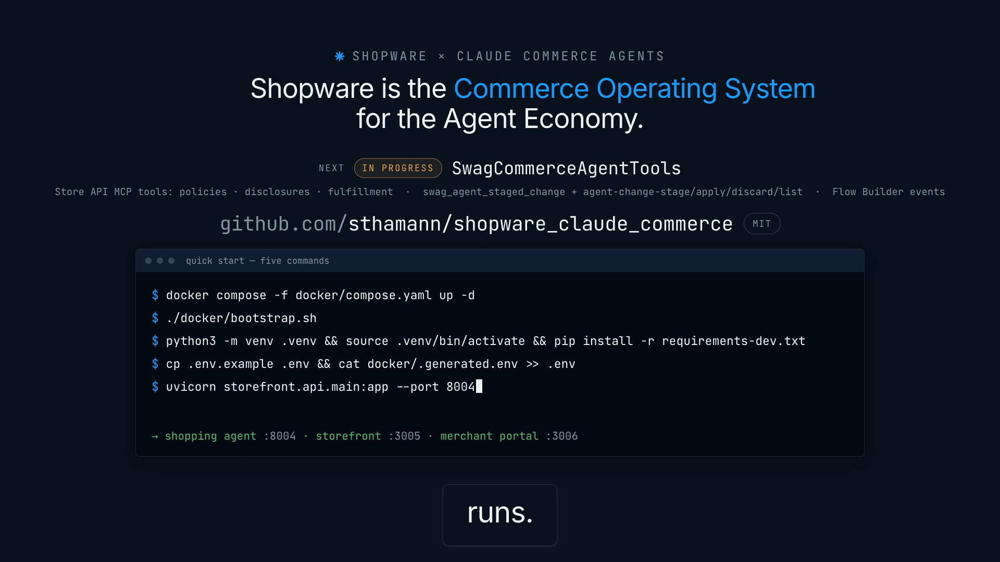

# Explainer video — Shopware × Claude Commerce Agents



- `explainer.mp4` — **v2 (final, published):** 1920×1080, H.264 + AAC, 30 fps, 2:03 (122.6 s). English voiceover, captions, music bed. Ten frames.
- `explainer-draft.mp4` — **v3 (draft):** 1920×1080, H.264 + AAC 48 kHz stereo, 30 fps, 2:29 (149.37 s). Twelve frames; adds the Claude Code plugin, MCP as first-class transport, security hardening, the eval suite + CI, and the Phase 4 roadmap line. Two frames carry tagged HTML recreations that the final render replaces with live captures (see *Draft vs final*).
- `explainer-web.mp4` — 1280×720 web variant of the **v2** cut (3.35 MB) for GitHub's inline player, see below. Untouched until v3 is final.
- `explainer-poster.png` — still from the **v2** closing frame (thesis line, repo lockup `github.com/sthamann/shopware_claude_commerce`, five-command quick start) for README embedding.
- `explainer/` — the HyperFrames project that produced the video (composition, storyboard, script, captured screens, generated audio). The project is at **v3** state; locally (gitignored) `renders/video.mp4` is the v2 render and `renders/draft.mp4` the v3 draft.

Repository shown in the video: **https://github.com/sthamann/shopware_claude_commerce** (on screen in frames 4, 10 and 12; the URL is not narrated — the voice points to "the repository link in the description").

## Draft vs final (v3)

`explainer-draft.mp4` is complete in narration, captions, music and timing. Two slots are placeholders:

| Slot | Frame | Element | Draft content | Final content |
|---|---|---|---|---|
| (a) merchant portal | 9 | `#f09-slot-portal` (`data-slot="live-capture:merchant-portal"`) | HTML recreation of the staged-change card + host log, tagged `recreation · live capture pending` | Real capture of `http://localhost:3006` — dashboard + assistant rail with a staged price change approved |
| (b) assistant chat | 8 | `#f08-slot-chat` (`data-slot="live-capture:assistant-chat"`) | HTML recreation of the assistant turn in the rail, tagged `recreation · live capture pending` | Real chat turn captured from `http://localhost:3005` (needs the storefront API on `:8004`) |

Swapping the slot contents must **not** change the frame `data-duration` or the cue times — the voice is locked and captions are mapped to it. Put the capture into the slot element (image or clipped video, same box), remove the `recreation · live capture pending` tag, re-run `lint` / `check`, render to `renders/video.mp4`, copy to `explainer.mp4`, regenerate the poster and `explainer-web.mp4`, then re-upload the attachment (see below). At the time of the draft render neither `:3006` nor the storefront API on `:8004` was reachable (chat replied "Couldn't reach the storefront host on port 8004"), so both slots stayed as recreations.

## Web variant for GitHub README

`explainer-web.mp4` is a 1280×720 re-encode of `explainer.mp4` (same 122.6 s cut, 30 fps, H.264 + AAC 96 kb/s stereo, `faststart`), 3.35 MB — inside GitHub's 10 MB attachment limit with headroom. Produced with:

```bash
ffmpeg -y -i docs/media/explainer.mp4 -vf scale=-2:720 -c:v libx264 -preset slow -crf 28 \
  -pix_fmt yuv420p -movflags +faststart -c:a aac -b:a 96k -ac 2 docs/media/explainer-web.mp4
```

GitHub only renders an inline video player for files uploaded as an *attachment* (drag the file into the README editor, an issue or a PR comment; GitHub returns a `https://github.com/user-attachments/assets/…` URL) and that URL is what goes into the README. A plain repository path such as `docs/media/explainer-web.mp4` is shown as a link, not as a player. Keep the file in the repo anyway so the attachment can be regenerated after a re-render.

Current upload: `https://github.com/user-attachments/assets/00286df3-c81d-45ca-8a78-c0c2d01a4ce9` (also stored in `github-video-url.txt`) — this is the URL referenced by the root `README.md` "Demo video" section; after the v3 final render, upload the new `explainer-web.mp4`, then update both places.

## What the video says (v3)

Twelve frames, 149.3 s. The narration is locked in `explainer/SCRIPT.md`; on-screen copy is short kinetic text, the spoken words appear as captions. Durations are the frame lengths from `STORYBOARD.md` (transitions overlap 0.4–0.5 s).

| # | Frame | Dur. | On screen | Narration |
|---|---|---|---|---|
| 1 | The moment | 11.6 s | Date ledger: Anthropic publishes the blueprint · "One day later." · "This is Shopware's." with a green `● RUNNING` status tag | September 2nd, 2026. Anthropic publishes an open-source blueprint for commerce agents. One day later — this is Shopware's implementation. Running. |
| 2 | Not a Claude shop | 7.3 s | "Not a Claude shop." struck through → "Shopware is the commerce execution layer — for any agent." | This is not a Claude shop. It's Shopware as the commerce execution layer — the system any agent runs on. |
| 3 | Two agents | 9.3 s | Two cards: shopping agent (`UCP over MCP`: search → compare → real cart → hand off to Shopware checkout), merchant agent (`Admin MCP`: analyze → stage → human approves → apply) | Two agents. Shopping: search, compare, a real cart, hand off to Shopware checkout. Merchant: analyze, stage, a human approves, apply. |
| 4 | How it's wired | 16.3 s | Animated diagram: Claude → `anthropics/commerce-agents` (pinned @ fd4d5922, 0 changes) → `storefront/api` + `merchant/api` under `github.com/sthamann/shopware_claude_commerce` → Shopware band: `/.well-known/ucp` (discovery), `/ucp/mcp` with session strip `initialize → Mcp-Session-Id → tools/call`, `/api/_mcp` (MCP · primary), `dryRun=true` callout, `/ucp/v1/*` + `/api/search/*` tagged `REST · fallback` | Anthropic's blueprint packages — pinned, unmodified. Two thin Shopware backends. MCP on both sides: shoppers over UCP-MCP, merchants over the Admin MCP — dry-run previews computed on the server. REST is the fallback. |
| 5 | One curl | 6.5 s | Terminal: `curl -s http://localhost:8080/.well-known/ucp \| jq .` streams the live discovery document (version, transports rest/mcp/embedded, capabilities, ES256 signing keys) | One curl to the well-known endpoint — and Shopware announces what it speaks, and the keys it signs with. |
| 6 | Three advantages | 10.8 s | Cards 01 Native UCP · 02 Dry-run previews (`before 29.99 → after 27.99`, `dryRun=true`) · 03 Commerce semantics (promotions, rules, variants, price disclosures) | Three things a bolt-on can't do: native UCP, dry-run previews from the core, and commerce semantics — promotions, rules, variants, price disclosures. |
| 7 | The model proposes | 16.3 s | "Enforced, not prompted" → "The model proposes." / "A person — or a policy — applies." / "Provenance gates: only IDs this session has seen." → hardening ledger: 01 Signed requests (RFC 9421 + RFC 9530 · ES256 · Idempotency-Key) · 02 One-time handoff code (HMAC, single use, into Shopware checkout) · 03 Least-privilege Integration (own ACL role) · 04 Identity linking (UCP · OAuth) → "Checkout completes in Shopware. Never in the agent." | The model proposes; a person — or a policy — applies. Provenance gates accept only IDs the session has seen. Signed requests, a one-time handoff code, a least-privilege Integration. And checkout completes in Shopware — never in the agent. |
| 8 | Demo: shop to checkout | 9.9 s | Real screenshots of `localhost:3005` (grid + assistant rail, cart drawer with "Check out on Shopware") and the real Shopware checkout showing the same cart (CA-TSHIRT ×2, €59.98). **Slot (b)** `#f08-slot-chat` — assistant turn, recreation in the draft | Watch it run. Search the live catalog. Add to a real Shopware cart. Then — Check out on Shopware. Same cart, same total — in the shop's own checkout. |
| 9 | Demo: stage, approve, apply | 13.0 s | **Slot (a)** `#f09-slot-portal` — recreation in the draft: `stage_price_update(...)` → `POST /api/_mcp · tools/call shopware-entity-upsert · dryRun=true` → StagedChange card (before 29.99 / after 27.99, guardrails ok) → host log: 0 writes, approval required → approve → same payload replayed `dryRun=false` → `applied` | A price change is staged as a server-side dry run over the Admin MCP — before and after become the diff. Nothing touches the shop until someone approves. Then one call replays it. |
| 10 | Build your own · Claude Code plugin | 11.7 s | Terminal: `claude plugin marketplace add sthamann/shopware_claude_commerce` → `claude plugin install shopware-commerce-builder@shopware-claude-commerce` → `✓ installed — 5 commands · 6 skills` → `/scaffold-shopware-agent`; two chip columns: FIVE COMMANDS (`/scaffold-shopware-agent`, `/add-shopware-flow`, `/author-shopware-evals`, `/review-shopware-agent`, `/shopware-ucp-doctor`) · SIX SHOPWARE SKILLS (UCP mapping, Admin MCP, promotions, variants, German compliance, identity & handoff) | Build your own with Claude Code: add the marketplace, install the plugin, run scaffold. Five commands, six Shopware skills, from UCP mapping to German compliance. |
| 11 | Tested like software · evals/ + CI | 17.6 s | `107 eval cases` (64 shopping · 43 merchant) · "snapshot state + one message → one real turn → deterministic scorers" · positive/negative pair card (`shop-variant-001-family-without-size-asks` ↔ `shop-variant-002-variant-chosen-adds-variant-id`) · four case rows: family without a size → asks · discard, then apply → refused · Grundpreis → byte-exact · injection in product description → cart untouched · CI strip: `ci.yml` (ruff · pytest · web builds · PHP) · nightly `integration.yml` (Docker Shopware + smokes) · gates: pass rate · cache-hit rate · cost per turn | Tested like software: a hundred and seven eval cases, every positive with a negative twin — family without a size, discard then apply refused, Grundpreis byte-exact, injection in a product description. CI gates pass rate, cache hits and cost per turn. |
| 12 | Commerce Operating System | 19.0 s | "Shopware is the Commerce Operating System for the Agent Economy." → roadmap row `NEXT · IN PROGRESS · SwagCommerceAgentTools` (Store API MCP tools: policies · disclosures · fulfillment · `swag_agent_staged_change` + `agent-change-stage/apply/discard/list` · Flow Builder events) → `github.com/sthamann/shopware_claude_commerce` with an `MIT` pill → terminal typing the five README commands | Shopware is the Commerce Operating System for the Agent Economy. Next, in progress: SwagCommerceAgentTools, agent tools and staged changes inside Shopware. Repository link in the description. Five commands — and it runs. |

Notes on the footage:

- Frame 8 uses real captures of the running stack (2026-09-03) for the grid, cart drawer and Shopware checkout. The assistant turn inside the rail is slot (b), an HTML recreation in the draft.
- Frame 9 is slot (a): an HTML build using the real `StagedChange.items[] {target, field, before, after}` shape, the Admin MCP tool name and the `dryRun` mechanism; price values are illustrative (labelled `example values · seeded catalog`).
- Frame 5's JSON is the live `/.well-known/ucp` response, condensed to fit (`capture/extracted/ucp-discovery.json` holds the full document).
- Frame 11's case count (107 = 64 shopping + 43 merchant) was read from `evals/cases/*.yaml` at build time and matches `evals/README.md`. Re-check before the final render if cases were added (the number is spoken in line 11, so a change means regenerating `assets/voice/11.wav`).
- Sources for the v3 additions: `plugins/shopware-commerce-builder/README.md`, `docs/shopware-mapping.md`, `MASTERPLAN.md` §4.2 (ADR-10/12/14) and §5/§6, `evals/README.md`, `.github/workflows/ci.yml` + `integration.yml`, `shopware-plugins/SwagCommerceAgentTools/composer.json`.

## Re-render

Everything runs from `docs/media/explainer/` with the HyperFrames CLI (`hyperframes@0.8.27` pinned in `package.json`). Fonts (Inter, JetBrains Mono — OFL) are staged in `assets/fonts/`, narration in `assets/voice/`, the music bed in `assets/bgm/track.wav`, so a re-render needs no network beyond the GSAP CDN used by the assembled `index.html`.

```bash
cd docs/media/explainer

# 1. Validate the assembled composition
npx hyperframes lint
npx hyperframes check

# 2a. Draft (current state, placeholders in frames 8/9)
npx hyperframes render --skill=product-launch-video --quality high --output renders/draft.mp4
cp renders/draft.mp4 ../explainer-draft.mp4

# 2b. Final (after the live captures are in the slots) — ≈60 s on an M-series Mac
npx hyperframes render --skill=product-launch-video --quality high --output renders/video.mp4
cp renders/video.mp4 ../explainer.mp4
ffmpeg -y -ss 147.8 -i ../explainer.mp4 -frames:v 1 ../explainer-poster.png

# Optional: contact sheet of frame midpoints for review
npx hyperframes snapshot --at 5.8,15.2,23.8,36.3,48,56.4,70.2,83.3,94.8,107,121.7,140
```

### Changing a frame

Frames are sub-compositions in `compositions/frames/NN-*.html` (one file per storyboard frame, GSAP timeline registered under the frame id). Edit the file, then re-run `lint` / `check` / `render`. If a frame's *duration* changes you must re-assemble and re-inject transitions:

```bash
SK=$(realpath ~/.cursor/skills/product-launch-video)   # workflow scripts (symlinked from ~/.claude/skills)
node $SK/scripts/assemble-index.mjs --storyboard ./STORYBOARD.md --hyperframes .
node $SK/scripts/transitions.mjs inject --storyboard ./STORYBOARD.md --hyperframes .
node $SK/scripts/transitions.mjs verify --storyboard ./STORYBOARD.md --index ./index.html
```

### Changing the narration

1. Edit the spoken lines in `SCRIPT.md` (and the matching `voiceover:` guide in `STORYBOARD.md`).
2. Regenerate the voice with Kokoro (offline; voice `bm_george`). Kokoro needs a Python with `kokoro-onnx` + `soundfile`:

```bash
python3 -m venv ~/.hyperframes-venv && ~/.hyperframes-venv/bin/pip install kokoro-onnx soundfile
export HYPERFRAMES_PYTHON=~/.hyperframes-venv/bin/python
node $SK/scripts/audio.mjs --script ./SCRIPT.md --storyboard ./STORYBOARD.md --hyperframes . \
  --out ./audio_meta.json --provider kokoro --voice bm_george
node $SK/scripts/audio.mjs sync-durations --audio-meta ./audio_meta.json --storyboard ./STORYBOARD.md
```

3. Word timings in `audio_meta.json` come from ASR and may mis-hear product names ("clawed", "ShopWear", "Grund price"); the captions are built from these words, so re-map them onto the script text before building captions (a small difflib alignment over `SCRIPT.md` tokens — keep the timings, replace the text).
   To regenerate a *single* line instead of all twelve, run `npx hyperframes tts <textfile> --voice bm_george --output assets/voice/NN.wav`, then `npx hyperframes transcribe assets/voice/NN.wav --model small.en --dir <tmpdir>` for the word timings, and patch that voice's `duration_s` / `words` in `audio_meta.json` before the re-map. The last line (`12.wav`) carries 2.8 s of appended silence (`ffmpeg -af apad=pad_dur=2.8`) for the closing hold.
4. Rebuild captions, update the frame `data-duration`s to the synced values, then assemble / inject / render as above. If the total length changes, re-trim the music bed to the new total with a fresh fade-out (`ffmpeg -af "atrim=0:<total>,afade=t=in:d=1.5,afade=t=out:st=<total-3>:d=3"`):

```bash
node $SK/scripts/captions.mjs build --storyboard ./STORYBOARD.md --audio-meta ./audio_meta.json --hyperframes . --out ./caption_groups.json
```

### Music bed

`assets/bgm/track.wav` was generated locally with MusicGen (`facebook/musicgen-small`, prompt: dark minimal technical electronic underscore, 96 BPM, no vocals). For v3 a 28 s segment of the original render is looped to the 149.3 s narration length, faded in 1.5 s / out 3 s, mounted at `data-volume="0.12"`. To regenerate from scratch: install `torch transformers soundfile numpy` into the same venv, put it first on `PATH`, and run the media-use audio engine with `bgm.mode = "generate"` (see `~/.cursor/skills/media-use/audio/references/bgm.md`). With a HeyGen credential the same step retrieves a licensed catalog track instead.

## Project layout (`explainer/`)

| Path | Purpose |
|---|---|
| `BRIEF.md` | the confirmed brief (route, message, destination, style notes) |
| `STORYBOARD.md` | twelve frames with time-coded shot sequences, synced durations and the live-capture slot notes |
| `SCRIPT.md` | locked narration (v3, twelve lines) |
| `frame.md` | design system (code-editorial preset, inverted to the dark register; Shopware blue `#189EFF`, Claude warm `#D97757`) |
| `compositions/frames/*.html` | the twelve frame sub-compositions (`08` / `09` contain the `data-slot` placeholders) |
| `compositions/captions.html` | generated caption track |
| `index.html` | assembled host composition (frames, voice, music, captions, transitions) |
| `assets/` | fonts, captured screenshots, voice WAVs, music bed, UCP discovery JSON |
| `capture/` | raw capture of `localhost:3005` + asset inventory (`extracted/asset-descriptions.md`) |
| `audio_meta.json` | voice/word timings + BGM entry consumed by captions and the assembler |
| `renders/`, `snapshots/` | gitignored working output: `renders/video.mp4` (v2 final), `renders/draft.mp4` (v3 draft), review snapshots (`snapshots/contact-sheet.jpg` is the force-tracked v2 sheet) |
